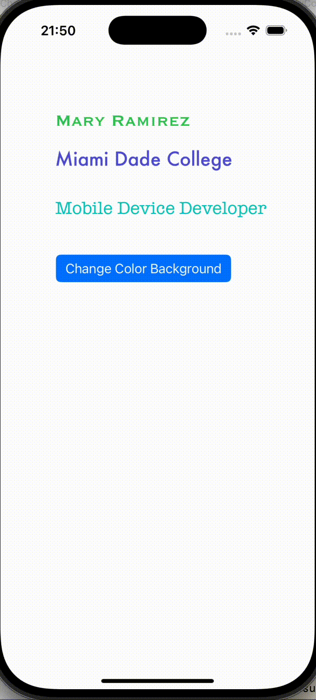

# Prework - *Change Background Color*

Submitted by: **Mary E Ramirez**

**Change Background Color ** is an app that lets the user change the screen color to a random color by tapping a button

Time spent: **1** hours spent in total

## Required Features

The following **required** functionality is completed:

- [X] Users are see a screen with three labels and a button
- [X] Tapping the button changes the screen color to a random color
 
## Video Walkthrough

## App Brainstorming (Step 4)

### Favorite Apps & Features  

 **1. Spotify**  
- Personalized playlists  
- Offline listening  
- Device syncing  

**2. WhatsApp**  
- Fast messaging  
- Voice/video calls  
- Group chats  

**3. TikTok**  
- Personalized video feed  
- Editing tools and filters  
- Strong recommendations  

### 🚀 App Idea: Mood Color  

I’d like to create an iOS app called **Hydration Tracker**. The idea is that tapping a button instantly changes the screen background to a random color. Users could save their favorite shades, view a color history, and even share colors with friends.  

Planned features include:  
to help users stay properly hydrated throughout the day. The app allows users to log their water intake, set reminders, and track daily, weekly, or monthly progress with visual charts.  

**Planned features:**  
- Quick log button to record water intake (e.g., 8 oz, 12 oz, custom amount)  
- Daily goal tracker with visual progress bar  
- Custom reminders to drink water at set intervals  
- History log to review daily, weekly, and monthly hydration trends  
- Optional motivational messages and achievements  

## Notes

- One challenge I encountered while building the app was creating the IBAction. When I followed the steps, Xcode created an IBOutlet instead of an IBAction.

## License

    Copyright [2025] [Mary Ramirez]

    Licensed under the Apache License, Version 2.0 (the "License");
    you may not use this file except in compliance with the License.
    You may obtain a copy of the License at

        http://www.apache.org/licenses/LICENSE-2.0

    Unless required by applicable law or agreed to in writing, software
    distributed under the License is distributed on an "AS IS" BASIS,
    WITHOUT WARRANTIES OR CONDITIONS OF ANY KIND, either express or implied.
    See the License for the specific language governing permissions and
    limitations under the License.
